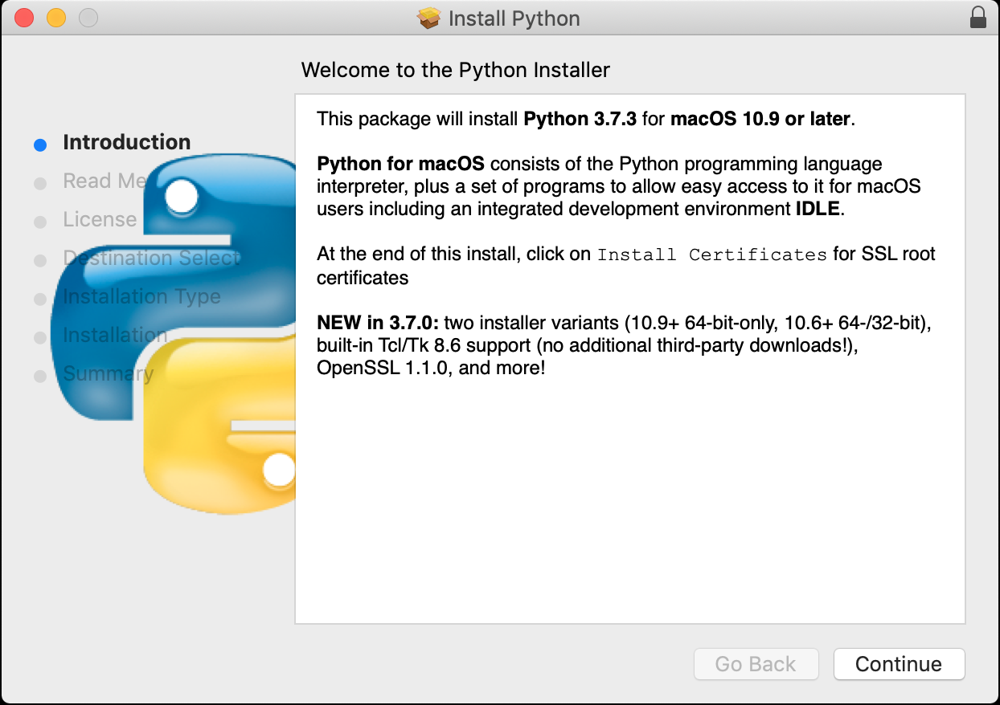

# PythonGame
A simple Python Game 

## Setup/Installation
- This game uses Python3 and Pygame engine in order to run
- Game supports Windows, Mac, Linux
- An IDE is not required 

### Installing Python
#### Step 1. Head over to `https://www.python.org/downloads` to download the latest Python

#### Step 2. Run the Python installer and use default settings

#### Step 3. Verify Python was installed correctly
- On Windows, open the command prompt and run the following command
```bash 
python -V
```
- The Python version should be displayed

- If you do not see a version appear, go back and attempt to reinstall Python with default settings

### Installing Pygame
#### Step 1. Open the command prompt and enter the following command
```bash
python -m pip install -U pygame --user
```
#### Step 2. To see if works, run the following command
```bash
python -m pygame.examples.aliens
```
- If it works, then you are ready to proceed , otherwise retry Pygame installation

### Installing PyCharm
#### Step.1 Head over to `https://www.jetbrains.com/pycharm/download/` to download Python Community Edition (Free)
#### Step.2 Run the install and use default settings 
#### Step.3 Open Pycharm and verify installation

### Download and open the starter project in Pycharm
### Step.1 Head over to `dummy` and click on download 
```bash
dummy dummy 
```

### Step.2 Open Pycharm and open the starter project
```bash
dummy dummy 
```

### Step.3 Verify all starter files exist
- The folder should contain 3 Files that we will be using
- `Main.py` This is the main file that will run our game
- `Game.py` This is where all the Game logic and graphics will be defined, partially filled out
- `Master.py` This holds what the final verison of `Game.py` should look like, use it as reference

## Coding the Game


